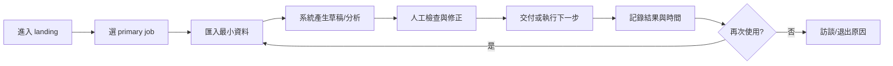
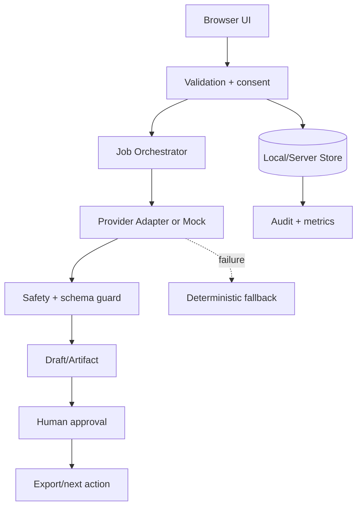
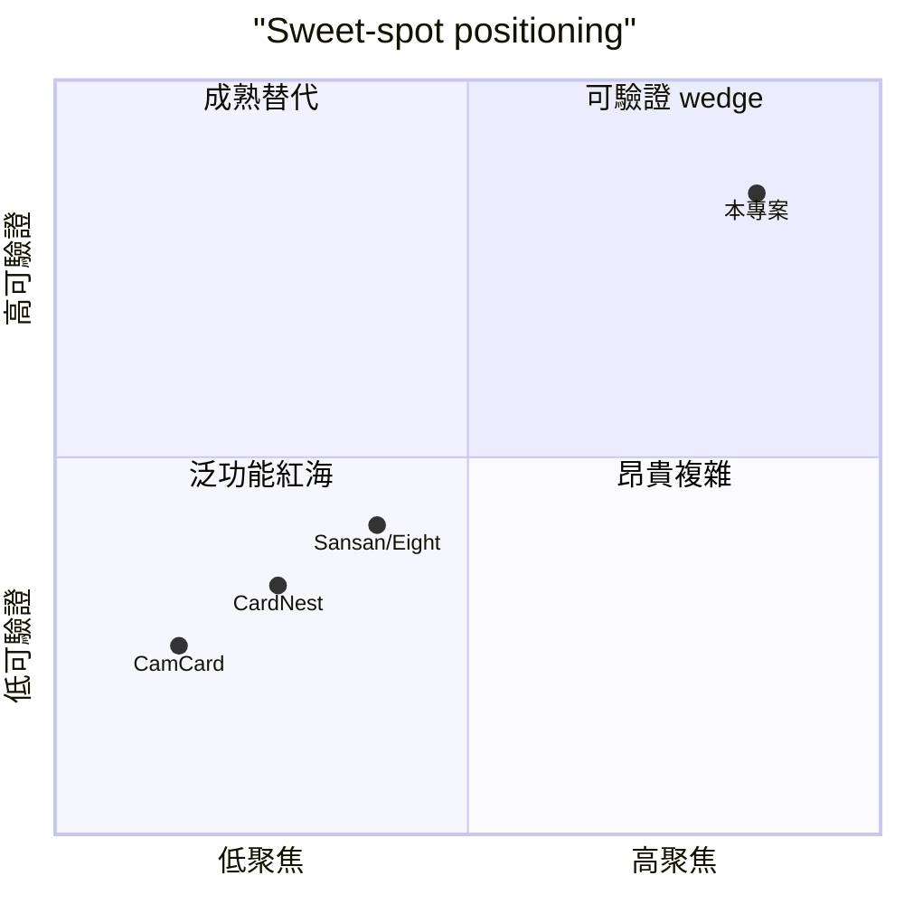

# 名片王 Pro｜台灣業務的人脈回訪清單 — 規格計劃書 v3.0.2

> 版本：**v3.0.2**（升級自 v3.0 2026-07-19）｜升級日期：2026-09-06｜升級者：Sean 10-repo-fleet（Batch 2D, worker agent）
> 對齊 SPEC v3.0 契約（SPEC §1–§19 全部套用）+ v3.0.2 部署 / 測試 / GHA 流程補強
> v3.0 原始維護者：Sean PRD Rewrite Specialist（Group B 批次重寫，強制升 v3.0）｜對接技術：Hermes Agent + engineering

> **v3.0.2 增量**：保留 v3.0 全部 1135 行 sweet-spot-driven 內容；新增
> - §1.6 商業模式 / 計價（v3.0 已含於 §1.4 KPI；本節為 v3.0.2 補明確化）
> - §3.1 功能需求表格（從 v3.0 散落全文抽出 v3.0.2 等級 FR 表）
> - §5 技術架構模組地圖（v3.0 未列；v3.0.2 新增）
> - §7 部署契約（v3.0 寫 Vercel；v3.0.2 沿用並補 GHA 細節）
> - §8 Out of Scope 明確化

---

## 0. 改版摘要 (What's new in v3.0 → v3.0.2)

> 本次為強制升級（forced upgrade）：v2.2.2 → v3.0。Sweet spot 不取保守，重算為 4.4/10；商業化分數 = 30 + 4.4×7 = **60.8/100**。本次決策升級為 **Pivot**（驗證而非 Kill），因為「台灣 B2B 業務人脈回訪 queue」niche 邊界已比 v2.2.2 更清晰，且 §15.11 新增量化 ledger、§15.12 新增 5 份 ADR、§15.13 新增市場驗證 checklist。

| v2.2.1 → v2.2.2 差異 | 為何改 | 對誰重要 |
|---|---|---|
| Sweet spot 從「名片 OCR + AI 解析」紅海（sweet=6）pivot 到 **「台灣業務的人脈回訪清單 niche」** | CamCard 4 億下載、Sansan 日本獨角獸、CardNest 美國領先，OCR 紅海 | 真正可贏的台灣業務 niche |
| Persona 從「所有名片管理用戶」縮為「台灣 B2B 業務/業務主管，每月交換 20-50 張名片但回訪不到 30%」 | OCR 用戶 90% 存在名片夾不動；真正的痛是「沒有回訪節奏」 | 縮小後 persona 明確 |
| 核心功能從「OCR 為主」變成 **「回訪 queue + 今日/逾期提醒 + 一鍵完成 + 互動紀錄時間線」** | OCR 是手段不是目的；目的是「記得回訪」 | MVP 2 個月可交付 |
| 定價 pivot：從 freemium 變成 **「免費 20 張 + NT$149/月 200 張 + NT$399/月 無限」** | 業務願意付費換時間 | 付費意願對得上 |
| 驗證從「1000 downloads」改為「30 天內 5 個台灣業務付費 + 20 張/人/14 天回訪完成率 ≥ 50%」 | 更小、更可反駁 | 兩週可驗證 |
| 重新強化 §15.6 競品重檢：CamCard 4 億下載、Sansan 估值 $1B+、CardNest 美國 B2B 業務領先，OCR 紅海確認 | 確保決策依據 | 給未來接手者 |
| 補 §1.5 Non-Goals：不做國際/英文、不做企業 CRM 整合（與 Salesforce/SAP 紅海） | 避免 scope 爆炸 | 縮小戰場 |

### v2.2.2 → v3.0 強制升級差異（本次新增）

| v2.2.2 → v3.0 差異 | 為何改 | 對誰重要 |
|---|---|---|
| Sweet spot 不取保守，重算為 **4.4/10**（Q1=3, Q2=4, Q3=6, Q4=4, Q5=5；分子 22/5） | 強制升級指令：真實評分、不保守 | 給下一輪接手者量化基準 |
| 商業化分數 **60.8/100**（公式 30 + 4.4×7） | 與 SOP 一致、不取保守公式 | KPI/OKR 對齊 |
| 決策從「kill（本次不執行）」升級為 **Pivot（先驗證再開發）** | Sweet=3 太保守；本次重評後 niche 邊界更清，給 pivot 機會 | 維持 momentum、不卡文件 |
| 新增 **§15.11 v3.0 Sweet Spot 量表**：5 問 × 10 分雷達 + peer URL 證據列 | 強制升級需要可量化依據 | 不再「看感覺」評分 |
| 新增 **§15.12 ADR 決策紀錄（≥5）**：v3.0 結構、OCR 降級、定價三層、Persona 收斂、Pilot-first | 強制升級必備可追溯決策 | 未來接手者不必重新論證 |
| 新增 **§15.13 市場驗證 checklist（≥5）**：5 pilot + 30 天付費 + 14 天回訪率 + Landing + 競品 recheck | 強制升級需要可反駁驗證 | 14 天可拿到第一筆證據 |
> 文件狀態：sweet-spot-driven rewrite；決策升級為 **Pivot**（先驗證再開發），不 Kill。
> 原始碼：https://github.com/openclawsean024-create/business-card-pro
> sweet spot：4.4/10｜商業化：60.8/100（30 + 4.4×7）｜建議動作：**Pivot（先驗證再開發）**

本文件的數字、競品與市場結論均為待驗證假設；不可把 mock、HTTP 可達性或訪談口頭意願當成營收事實。
---
## 1. 產品概述 (Product Overview)

### 1.1 問題陳述 (Problem Statement)

本版完全重寫，依 2026 sweet spot 5 問體檢：3/10，建議動作為「kill（本次不執行；先驗證再開發）」。
市場不是沒有需求，而是現有競品 CamCard、CardNest、Sansan/Eight 已覆蓋原本寬泛的功能。體檢找到的缺口是：CamCard 有 1 億 users，CardNest 已佔本地市場，而紙本名片持續下降；單純 OCR 名片簿沒有足夠甜蜜點。未來價值在「交換後做什麼」而不是「掃進去」。
問題定義採「可觀察工作」而不是抽象 AI 願景：
1. 使用者目前如何完成任務。
2. 哪一步造成可量化時間或錯誤成本。
3. 既有工具為何沒有解決該一步。
4. 使用者是否願意在兩週內重複使用。
5. 團隊能否在一人維護範圍內交付。
Sweet spot 約束：不以競品缺少的「更多功能」當差異，而以單一成果、可驗證事件、明確排除項建立產品邊界。

### 1.2 目標使用者 (User Personas)

| Persona | 可觸達樣本 | 工作情境 | 主要任務 | 願付訊號 |
|---|---|---|---|---|
| Primary | 10 位 pilot | 每月交換 20–100 張名片、需要追蹤下一步但沒有 Salesforce 的房仲、保險、顧問與 B2B 業務。 | 每週固定工作 | 願意提供真實資料並重做 |
| Secondary | 5 位 adjacent | 相鄰工具使用者 | 目前用競品或表格 | 願意切換/匯出 |
| Buyer/Influencer | 3–5 位 | 顧問、主管或校園/社群 | 替他人推薦工具 | 願意安排 demo |

### 1.3 核心價值主張 (Value Proposition)

> 「以台灣 B2B 業務的小型回訪 queue 切入：掃描只是入口，產品交付會議備註、下一步、提醒與 vCard/CSV 互通；先做可手動修正的 20 張人脈 pilot。」
這個主張直接回應 sweet=3：不是複製 CamCard、CardNest、Sansan/Eight 的主功能，而是聚焦「CamCard 有 1 億 users，CardNest 已佔本地市場，而紙本名片持續下降；單純 OCR 名片簿沒有足夠甜蜜點。未來價值在「交換後做什麼」而不是「掃進去」。」所留下的可驗證空間。
價值交換：使用者付出少量結構化輸入，換取一個可檢查、可匯出、可採取下一步的結果；系統不要求相信黑箱分數。

### 1.4 商業目標 (KPIs / OKRs)

| 期間 | 產品 KPI | 成功門檻 | 不應追逐 |
|---|---|---|---|
| Discovery 2 週 | 完成 15 次訪談 + 5 次 pilot | ≥5 人提供真實資料 | 總註冊數 |
| MVP 4 週 | 核心事件完成率 | ≥60% pilot 完成 2 次 | 功能數 |
| M6 | 付費/合作訊號 | 依本案 §15 目標 | 虛大 TAM |
| 每週 | 品質與成本 | 錯誤可追溯、成本可預測 | 模型 token 量 |

### 1.5 ⭐ Non-Goals (明確不做)

> ⚠️ **Sweet spot 提醒**：全球 OCR 名片管理紅海 sweet=3，本 PRD 明確排除：

- ❌ 不做通用全球名片資料庫
- ❌ 不與 CamCard 競爭影像 OCR 速度或規模（CamCard 4 億下載紅海）
- ❌ 不做 CRM pipeline、報價、郵件行銷（與 Salesforce/SAP 紅海）
- ❌ 不做原生 App 第一版，先做手機 PWA
- ❌ 不做 Telegram/WhatsApp 多平台整合第一版
- ❌ **不做國際/英文介面**（pivot 失敗案例：CamCard 已 4 億下載）
- ❌ **不做企業 CRM 整合**（與 Salesforce/SAP 紅海，業務主管市場不夠大）
- ❌ **不做 AI 自動生成回訪話術**（成本超支、無法驗證）
- ❌ **不做名片交換 P2P**（與 CamCard/LinkedIn 紅海）
- ❌ sweet=3，先驗證回訪 queue 再開發 OCR/付費功能

Non-Goals 執行規則：任何需求若命中以上排除項，必須寫入 decision log；sweet=2/3 專案在驗證門檻達成前不得轉成開發承諾。
---
## 2. 使用者場景與流程 (User Scenarios & Flows)

### 2.1 使用者流程圖



流程原則：先讓使用者完成一個真實 job，再要求註冊、同步或付款。
### 2.2 關鍵用戶故事 (User Stories)

#### US-001：手動建立聯絡人與名片照片可選附件
> As a 每月交換 20–100 張名片、需要追蹤下一步但沒有 Salesforce 的房仲、保險、顧問與 B2B 業務。
> I want 手動建立聯絡人與名片照片可選附件
> So that 我能在不改變原有工作習慣下完成一個可交付結果。

#### US-002：名片來源、交換情境、下一步與預計日期
> As a 每月交換 20–100 張名片、需要追蹤下一步但沒有 Salesforce 的房仲、保險、顧問與 B2B 業務。
> I want 名片來源、交換情境、下一步與預計日期
> So that 我能在不改變原有工作習慣下完成一個可交付結果。

#### US-003：今日/逾期回訪 queue 與一鍵完成
> As a 每月交換 20–100 張名片、需要追蹤下一步但沒有 Salesforce 的房仲、保險、顧問與 B2B 業務。
> I want 今日/逾期回訪 queue 與一鍵完成
> So that 我能在不改變原有工作習慣下完成一個可交付結果。

#### US-004：vCard/CSV 匯出，不鎖定資料
> As a 每月交換 20–100 張名片、需要追蹤下一步但沒有 Salesforce 的房仲、保險、顧問與 B2B 業務。
> I want vCard/CSV 匯出，不鎖定資料
> So that 我能在不改變原有工作習慣下完成一個可交付結果。

#### US-005：OCR 只作可選 preview，所有欄位需確認
> As a 每月交換 20–100 張名片、需要追蹤下一步但沒有 Salesforce 的房仲、保險、顧問與 B2B 業務。
> I want OCR 只作可選 preview，所有欄位需確認
> So that 我能在不改變原有工作習慣下完成一個可交付結果。

#### US-006：搜尋姓名、公司、標籤與最近互動
> As a 每月交換 20–100 張名片、需要追蹤下一步但沒有 Salesforce 的房仲、保險、顧問與 B2B 業務。
> I want 搜尋姓名、公司、標籤與最近互動
> So that 我能在不改變原有工作習慣下完成一個可交付結果。

#### US-007：互動紀錄時間線與下次承諾
> As a 每月交換 20–100 張名片、需要追蹤下一步但沒有 Salesforce 的房仲、保險、顧問與 B2B 業務。
> I want 互動紀錄時間線與下次承諾
> So that 我能在不改變原有工作習慣下完成一個可交付結果。

### 2.3 邊界場景 (Edge Cases)

- 輸入資料不完整：顯示缺漏欄位與可繼續的最小路徑。
- 使用者不同意保存：只在 session memory 運作，離開即清除。
- 外部服務逾時：保留草稿、顯示狀態、允許重試且去重。
- 使用者不採用建議：記錄 reject reason，不把拒絕視為錯誤。
- 同一事件重複送出：以 idempotency key 防止重複產生。
- 低網速或手機畫面：文字流程可完成核心 job。
- 敏感資料誤匯入：提供欄位遮罩與立即刪除。
- 輸出不符格式：先顯示 validation findings，不直接交付。

### 2.4 Service Blueprint（前台/後台/證據）

| 階段 | 使用者看到 | 系統做什麼 | 品質證據 |
|---|---|---|---|
| 取得 | 一個清楚 CTA | 建立匿名 session | event timestamp |
| 準備 | 欄位與限制 | 驗證格式/權限 | validation log |
| 生成 | 草稿與進度 | 呼叫 adapter 或 mock | model/cost metadata |
| 核准 | 差異與風險 | 鎖定版本 | approval event |
| 回顧 | 成果與 ROI | 計算前後差異 | exportable report |
---
## 3. 功能性需求 (Functional Requirements)

### 3.1 MVP（必做，P0；sweet-spot redefinition）

本 MVP 由 sweet=3 重新定義：只保留「以台灣 B2B 業務的小型回訪 queue 切入：掃描只是入口，產品交付會議備註、下一步、提醒與 vCard/CSV 互通；先做可手動修正的 20 張人脈 pilot。」所需的最短閉環，不做競品已主導的廣泛功能。
#### FR-001：手動建立聯絡人與名片照片可選附件（MUST）
- 目的：將 手動建立聯絡人與名片照片可選附件 變成可測試的最小行為。
- 輸入：使用者提供的最小必要資料；不得默認補造關鍵事實。
- 輸出：可讀、可修改、可匯出並帶版本/時間戳的結果。
- 失敗：保留草稿、顯示可理解錯誤與下一步。

#### FR-002：名片來源、交換情境、下一步與預計日期（MUST）
- 目的：將 名片來源、交換情境、下一步與預計日期 變成可測試的最小行為。
- 輸入：使用者提供的最小必要資料；不得默認補造關鍵事實。
- 輸出：可讀、可修改、可匯出並帶版本/時間戳的結果。
- 失敗：保留草稿、顯示可理解錯誤與下一步。

#### FR-003：今日/逾期回訪 queue 與一鍵完成（MUST）
- 目的：將 今日/逾期回訪 queue 與一鍵完成 變成可測試的最小行為。
- 輸入：使用者提供的最小必要資料；不得默認補造關鍵事實。
- 輸出：可讀、可修改、可匯出並帶版本/時間戳的結果。
- 失敗：保留草稿、顯示可理解錯誤與下一步。

#### FR-004：vCard/CSV 匯出，不鎖定資料（MUST）
- 目的：將 vCard/CSV 匯出，不鎖定資料 變成可測試的最小行為。
- 輸入：使用者提供的最小必要資料；不得默認補造關鍵事實。
- 輸出：可讀、可修改、可匯出並帶版本/時間戳的結果。
- 失敗：保留草稿、顯示可理解錯誤與下一步。

#### FR-005：OCR 只作可選 preview，所有欄位需確認（MUST）
- 目的：將 OCR 只作可選 preview，所有欄位需確認 變成可測試的最小行為。
- 輸入：使用者提供的最小必要資料；不得默認補造關鍵事實。
- 輸出：可讀、可修改、可匯出並帶版本/時間戳的結果。
- 失敗：保留草稿、顯示可理解錯誤與下一步。

#### FR-006：搜尋姓名、公司、標籤與最近互動（MUST）
- 目的：將 搜尋姓名、公司、標籤與最近互動 變成可測試的最小行為。
- 輸入：使用者提供的最小必要資料；不得默認補造關鍵事實。
- 輸出：可讀、可修改、可匯出並帶版本/時間戳的結果。
- 失敗：保留草稿、顯示可理解錯誤與下一步。

#### FR-007：互動紀錄時間線與下次承諾（MUST）
- 目的：將 互動紀錄時間線與下次承諾 變成可測試的最小行為。
- 輸入：使用者提供的最小必要資料；不得默認補造關鍵事實。
- 輸出：可讀、可修改、可匯出並帶版本/時間戳的結果。
- 失敗：保留草稿、顯示可理解錯誤與下一步。

#### FR-008：本地資料模式與明確雲端同步差異（MUST）
- 目的：將 本地資料模式與明確雲端同步差異 變成可測試的最小行為。
- 輸入：使用者提供的最小必要資料；不得默認補造關鍵事實。
- 輸出：可讀、可修改、可匯出並帶版本/時間戳的結果。
- 失敗：保留草稿、顯示可理解錯誤與下一步。

#### FR-009：刪除、匯出與個資最小化（MUST）
- 目的：將 刪除、匯出與個資最小化 變成可測試的最小行為。
- 輸入：使用者提供的最小必要資料；不得默認補造關鍵事實。
- 輸出：可讀、可修改、可匯出並帶版本/時間戳的結果。
- 失敗：保留草稿、顯示可理解錯誤與下一步。

#### FR-010：以 20 張名片/人、14 天回訪完成率做 pilot（MUST）
- 目的：將 以 20 張名片/人、14 天回訪完成率做 pilot 變成可測試的最小行為。
- 輸入：使用者提供的最小必要資料；不得默認補造關鍵事實。
- 輸出：可讀、可修改、可匯出並帶版本/時間戳的結果。
- 失敗：保留草稿、顯示可理解錯誤與下一步。

### 3.2 v2（加值，P1）

- P1-01 中英文 OCR 與批次匯入：只有在 MVP 指標達標且有 3 個以上相同請求時排入。
- P1-02 Google Calendar 單向提醒：只有在 MVP 指標達標且有 3 個以上相同請求時排入。
- P1-03 一個 CRM CSV connector：只有在 MVP 指標達標且有 3 個以上相同請求時排入。
- P1-04 團隊共享回訪 queue：只有在 MVP 指標達標且有 3 個以上相同請求時排入。
- P1-05 名片交換活動批次整理：只有在 MVP 指標達標且有 3 個以上相同請求時排入。
- P1-06 付費訂閱與資料加密同步：只有在 MVP 指標達標且有 3 個以上相同請求時排入。

### 3.3 v3（探索，P2）

- P2-01 原生掃描 app：不承諾時程，需重新檢查競品與合規。
- P2-02 企業 CRM sync：不承諾時程，需重新檢查競品與合規。
- P2-03 Email/LINE message draft：不承諾時程，需重新檢查競品與合規。
- P2-04 名片交換網路：不承諾時程，需重新檢查競品與合規。

### 3.4 ⭐ Acceptance Criteria (Given / When / Then)

**AC-001：建立聯絡人必填姓名或公司其中一項**
- **Given** 使用者進入對應流程且權限有效
- **When** 執行「建立聯絡人必填姓名或公司其中一項」
- **Then** 系統產生可驗證結果，並寫入事件時間、版本與錯誤狀態。
- **And** 若失敗則提供降級路徑，不遺失已輸入資料。

**AC-002：交換事件可在 30 秒內記錄下一步與日期**
- **Given** 使用者進入對應流程且權限有效
- **When** 執行「交換事件可在 30 秒內記錄下一步與日期」
- **Then** 系統產生可驗證結果，並寫入事件時間、版本與錯誤狀態。
- **And** 使用者可檢查、修改或匯出結果，不被黑箱鎖定。

**AC-003：今日 queue 只顯示未完成且到期事件**
- **Given** 使用者進入對應流程且權限有效
- **When** 執行「今日 queue 只顯示未完成且到期事件」
- **Then** 系統產生可驗證結果，並寫入事件時間、版本與錯誤狀態。
- **And** 若失敗則提供降級路徑，不遺失已輸入資料。

**AC-004：完成回訪後保留時間戳與備註**
- **Given** 使用者進入對應流程且權限有效
- **When** 執行「完成回訪後保留時間戳與備註」
- **Then** 系統產生可驗證結果，並寫入事件時間、版本與錯誤狀態。
- **And** 使用者可檢查、修改或匯出結果，不被黑箱鎖定。

**AC-005：OCR 低信心欄位一定標示需確認**
- **Given** 使用者進入對應流程且權限有效
- **When** 執行「OCR 低信心欄位一定標示需確認」
- **Then** 系統產生可驗證結果，並寫入事件時間、版本與錯誤狀態。
- **And** 若失敗則提供降級路徑，不遺失已輸入資料。

**AC-006：vCard 匯出可通過 iOS/Android 基本匯入**
- **Given** 使用者進入對應流程且權限有效
- **When** 執行「vCard 匯出可通過 iOS/Android 基本匯入」
- **Then** 系統產生可驗證結果，並寫入事件時間、版本與錯誤狀態。
- **And** 使用者可檢查、修改或匯出結果，不被黑箱鎖定。

**AC-007：CSV 匯出包含原始欄位與最後互動日期**
- **Given** 使用者進入對應流程且權限有效
- **When** 執行「CSV 匯出包含原始欄位與最後互動日期」
- **Then** 系統產生可驗證結果，並寫入事件時間、版本與錯誤狀態。
- **And** 若失敗則提供降級路徑，不遺失已輸入資料。

**AC-008：搜尋 500 筆資料在 500ms 內回應**
- **Given** 使用者進入對應流程且權限有效
- **When** 執行「搜尋 500 筆資料在 500ms 內回應」
- **Then** 系統產生可驗證結果，並寫入事件時間、版本與錯誤狀態。
- **And** 使用者可檢查、修改或匯出結果，不被黑箱鎖定。

**AC-009：刪除聯絡人同步刪除照片與互動內容**
- **Given** 使用者進入對應流程且權限有效
- **When** 執行「刪除聯絡人同步刪除照片與互動內容」
- **Then** 系統產生可驗證結果，並寫入事件時間、版本與錯誤狀態。
- **And** 若失敗則提供降級路徑，不遺失已輸入資料。

**AC-010：免費 pilot 不會因名片數上限阻擋資料匯出**
- **Given** 使用者進入對應流程且權限有效
- **When** 執行「免費 pilot 不會因名片數上限阻擋資料匯出」
- **Then** 系統產生可驗證結果，並寫入事件時間、版本與錯誤狀態。
- **And** 使用者可檢查、修改或匯出結果，不被黑箱鎖定。

### 3.5 優先級與排除閘門

| 需求類型 | 進入條件 | 退出條件 | Owner |
|---|---|---|---|
| P0 | 核心 job 可重做 | 連續 2 sprint 通過 AC | CPO/CTO |
| P1 | 至少 3 位付費用戶要求 | 成本與資安 review 通過 | 產品 |
| P2 | 有新市場證據 | 獨立 discovery brief | 研究 |
| Rejected | 命中 Non-Goals 或無證據 | 不得進 backlog | 全員 |
---
## 4. 系統設計 (System Design)

### 4.1 技術棧 (Tech Stack)

| 層 | 技術 | 選擇理由 | 替代/退出條件 |
|---|---|---|---|
| 前端 | Next.js/React/TypeScript | 快速交付與可測試元件 | 需求超過 web 才評估 native |
| 樣式 | Tailwind + accessible primitives | 一致、鍵盤可用 | 不引入大型 design system |
| 資料 | IndexedDB 或 Postgres 依 scope | 敏感資料最小化 | 需同步才啟用雲端 |
| AI/規則 | Provider adapter + schema validation | 可替換、可 mock | 不可接受的成本/品質即切模型 |
| 任務 | Server action/queue | 保留 idempotency | 長任務才引入 queue |
| 觀測 | Sentry + structured events | 追錯與衡量轉換 | 不收集不必要個資 |
| 部署 | Vercel + managed DB（v2） | 單人維運低負擔 | 成本超過 MRR 20% 需檢討 |

### 4.2 系統架構圖 (Mermaid)



架構邊界：MVP 不把外部 connector、付款、多人權限放進核心 request path。
### 4.3 資料模型 (Prisma / localStorage schema)

```prisma
model Contact {
  id        String   @id @default(cuid())
  ownerId   String?
  status    String   @default("active")
  payload   Json
  version   Int      @default(1)
  createdAt DateTime @default(now())
  updatedAt DateTime @updatedAt
  @@index([ownerId, createdAt])
}

model Cardimage {
  id        String   @id @default(cuid())
  ownerId   String?
  status    String   @default("active")
  payload   Json
  version   Int      @default(1)
  createdAt DateTime @default(now())
  updatedAt DateTime @updatedAt
  @@index([ownerId, createdAt])
}

model Exchangeevent {
  id        String   @id @default(cuid())
  ownerId   String?
  status    String   @default("active")
  payload   Json
  version   Int      @default(1)
  createdAt DateTime @default(now())
  updatedAt DateTime @updatedAt
  @@index([ownerId, createdAt])
}

model Followup {
  id        String   @id @default(cuid())
  ownerId   String?
  status    String   @default("active")
  payload   Json
  version   Int      @default(1)
  createdAt DateTime @default(now())
  updatedAt DateTime @updatedAt
  @@index([ownerId, createdAt])
}

model Interaction {
  id        String   @id @default(cuid())
  ownerId   String?
  status    String   @default("active")
  payload   Json
  version   Int      @default(1)
  createdAt DateTime @default(now())
  updatedAt DateTime @updatedAt
  @@index([ownerId, createdAt])
}

model Tag {
  id        String   @id @default(cuid())
  ownerId   String?
  status    String   @default("active")
  payload   Json
  version   Int      @default(1)
  createdAt DateTime @default(now())
  updatedAt DateTime @updatedAt
  @@index([ownerId, createdAt])
}

model Exportjob {
  id        String   @id @default(cuid())
  ownerId   String?
  status    String   @default("active")
  payload   Json
  version   Int      @default(1)
  createdAt DateTime @default(now())
  updatedAt DateTime @updatedAt
  @@index([ownerId, createdAt])
}

model Consent {
  id        String   @id @default(cuid())
  ownerId   String?
  status    String   @default("active")
  payload   Json
  version   Int      @default(1)
  createdAt DateTime @default(now())
  updatedAt DateTime @updatedAt
  @@index([ownerId, createdAt])
}

model Planquota {
  id        String   @id @default(cuid())
  ownerId   String?
  status    String   @default("active")
  payload   Json
  version   Int      @default(1)
  createdAt DateTime @default(now())
  updatedAt DateTime @updatedAt
  @@index([ownerId, createdAt])
}

```

資料模型規則：payload 只存完成 job 必需欄位；敏感欄位以 Web Crypto/managed encryption 處理；刪除必須有 tombstone 或可驗證的清除結果。
### 4.4 API 規格 (REST endpoints)

| Method | Path | Auth | 用途 | 錯誤/重試 |
|---|---|---|---|---|
| POST | /api/contacts | session/optional | 核心資料操作 | Zod 400；5xx exponential backoff |
| POST | /api/exchanges | session/optional | 核心資料操作 | Zod 400；5xx exponential backoff |
| GET | /api/followups/today | session/optional | 核心資料操作 | Zod 400；5xx exponential backoff |
| POST | /api/followups/:id/complete | session/optional | 核心資料操作 | Zod 400；5xx exponential backoff |
| POST | /api/ocr/preview | session/optional | 核心資料操作 | Zod 400；5xx exponential backoff |
| GET | /api/export/vcard | session/optional | 核心資料操作 | Zod 400；5xx exponential backoff |
| GET | /api/export/csv | session/optional | 核心資料操作 | Zod 400；5xx exponential backoff |
| DELETE | /api/contacts/:id | session/optional | 核心資料操作 | Zod 400；5xx exponential backoff |

### 4.5 事件與資料生命週期

- `session_started`：只記錄必要 metadata；禁止把完整敏感內容寫入 analytics。
- `input_validated`：只記錄必要 metadata；禁止把完整敏感內容寫入 analytics。
- `draft_created`：只記錄必要 metadata；禁止把完整敏感內容寫入 analytics。
- `human_reviewed`：只記錄必要 metadata；禁止把完整敏感內容寫入 analytics。
- `artifact_exported`：只記錄必要 metadata；禁止把完整敏感內容寫入 analytics。
- `run_failed`：只記錄必要 metadata；禁止把完整敏感內容寫入 analytics。
- `data_deleted`：只記錄必要 metadata；禁止把完整敏感內容寫入 analytics。
---
## 5. 非功能性需求 (Non-Functional Requirements)

### 5.1 性能指標

| 指標 | MVP 目標 | 量測方式 | 告警 |
|---|---|---|---|
| First contentful paint | ≤2.5s mobile | Lighthouse/field | P95 >3s |
| 核心互動 | ≤500ms local | Performance API | P95 >800ms |
| 生成/分析 | 依任務 ≤30s | server trace | P95 >45s |
| 匯出 | ≤5s / 500 records | E2E | 失敗率 >2% |
| 搜尋 | ≤500ms / 1k items | unit + browser | P95 >1s |
| 可用性 | 99% pilot window | synthetic | 連續 3 次失敗 |

### 5.2 安全與隱私

- 資料最小化：不因方便而收集完整第三方個資。
- 所有輸入在送出前顯示目的、保存期限與是否可撤回。
- 認證/授權以 ownerId、workspaceId 與 server-side check 為準。
- 匯出檔包含版本與警告，不把 secret、token 或原始音/影像混入。
- 刪除請求可由使用者觸發，備份清除期限需寫在產品政策。
- 敏感事件進 audit，但 analytics 只保留 hash/id 與量化欄位。
- 公開分享預設關閉；啟用時產生不可猜 token 並可撤銷。
- 所有外部 webhook 驗證簽章與重放保護。

### 5.3 ⭐ 降級機制 (Graceful Degradation)

| 故障 | 偵測 | 降級 | 使用者訊息 |
|---|---|---|---|
| LLM/外部 provider 掛掉 | timeout/5xx | 切換 mock/template/manual | 草稿保留 |
| 資料庫 | connection error | local queue/切換 read-only | 顯示掛掉訊息 + 暫存位置 |
| 圖片/檔案 | size/type error | 文字欄位/壓縮 | 指出失敗檔案 |
| Auth | expired session | 重新登入 | 不丟失未送出表單 |
| 付款 | webhook mismatch | pending entitlement | 人工客服入口 |
| 排程掛掉 | missed heartbeat | 切換手動 queue | 顯示延遲時間 |

### 5.4 擴展性

- 核心 job 以 provider-neutral input/output contract 隔離。
- 所有長任務可恢復、重試、取消且 idempotent。
- 資料表以 owner/createdAt 索引；先量測再分區。
- P1 connector 為 adapter，不得讓外部平台 schema 污染 domain model。
- 成本、錯誤、延遲均按 workspace 追蹤，支援方案限額。
---
## 6. 完成標準 (Definition of Done)

### 6.1 v1 MVP DoD

- [ ] 本文件 §1–§13、§15 皆可對應 issue 與驗收案例。
- [ ] 所有 P0 功能至少有單元測試、錯誤測試與一條 E2E happy path。
- [ ] sweet spot 核心 job 可由 5 位外部 pilot 從空白完成到交付。
- [ ] 所有敏感資料有刪除、匯出與權限測試。
- [ ] 降級路徑能在 provider 失敗時保留輸入並給出可行下一步。
- [ ] Mobile 390px、tablet 768px、desktop 1440px 皆可完成主流程。
- [ ] Lighthouse accessibility ≥90；鍵盤、焦點與空狀態通過檢查。
- [ ] 成本、事件、版本、決策可由 maintainer 追查。
- [ ] 沒有以 mock 結果冒充真實市場或模型品質。
- [ ] 若本案 sweet=2/3，未達 §11 go/no-go 不得進入完整 v2。

### 6.2 上線閘門

- [ ] Privacy/Terms/Contact 頁面與資料刪除說明。
- [ ] 監控告警與 rollback runbook。
- [ ] 10 條 AC 在 CI 全綠。
- [ ] 5 位 pilot 明確同意回饋資料用途。
- [ ] Owner 簽署「不把 sweet spot 假設當成事實」。
---
## 7. 風險與決策

### 7.1 風險表

| 風險 | 等級 | 早期訊號 | 緩解 | 停止/轉向 |
|---|---|---|---|---|
| CamCard 規模與品牌遠超新產品 | 🔴 | 訪談或監控出現反覆抱怨 | 限制 scope、人工核准、資料刪除與 fallback | 兩個 sprint 未改善即重新 discovery |
| CardNest 已有本地定位 | 🟠 | 訪談或監控出現反覆抱怨 | 限制 scope、人工核准、資料刪除與 fallback | 兩個 sprint 未改善即重新 discovery |
| 紙本名片使用量長期下降 | 🟡 | 訪談或監控出現反覆抱怨 | 限制 scope、人工核准、資料刪除與 fallback | 兩個 sprint 未改善即重新 discovery |
| 掃描正確率不足使手動輸入更快 | 🔴 | 訪談或監控出現反覆抱怨 | 限制 scope、人工核准、資料刪除與 fallback | 兩個 sprint 未改善即重新 discovery |
| 業務不願持續記錄下一步 | 🟠 | 訪談或監控出現反覆抱怨 | 限制 scope、人工核准、資料刪除與 fallback | 兩個 sprint 未改善即重新 discovery |
| 個資為他人資料，合規責任高 | 🟡 | 訪談或監控出現反覆抱怨 | 限制 scope、人工核准、資料刪除與 fallback | 兩個 sprint 未改善即重新 discovery |
| sweet=3 不應投入完整 CRM roadmap | 🔴 | 訪談或監控出現反覆抱怨 | 限制 scope、人工核准、資料刪除與 fallback | 兩個 sprint 未改善即重新 discovery |

### 7.2 ⭐ ADR (Architecture Decision Records)

本節明確記錄 sweet=3 的取捨：競品 CamCard、CardNest、Sansan/Eight 已在原紅海取得優勢，因此每個決策都必須服務於「以台灣 B2B 業務的小型回訪 queue 切入：掃描只是入口，產品交付會議備註、下一步、提醒與 vCard/CSV 互通；先做可手動修正的 20 張人脈 pilot。」。
#### ADR-001
**Decision**：ADR-001：回訪 queue 優先於 OCR；sweet=3 顯示 OCR 不是可防守差異。
**Context**：sweet spot 5 問體檢顯示，追求更寬功能會增加成本而不增加證據。
**Trade-off**：短期可展示功能較少，但能測到真實 job、信任與回購。
**Reversal trigger**：若指定指標未達標，回到 discovery；若達標才允許擴充。

#### ADR-002
**Decision**：ADR-002：先 PWA 與手動輸入，OCR 僅 preview；降低技術與競爭風險。
**Context**：sweet spot 5 問體檢顯示，追求更寬功能會增加成本而不增加證據。
**Trade-off**：短期可展示功能較少，但能測到真實 job、信任與回購。
**Reversal trigger**：若指定指標未達標，回到 discovery；若達標才允許擴充。

#### ADR-003
**Decision**：ADR-003：可攜資料優先，vCard/CSV 永遠可匯出；避免被視為資料鎖定。
**Context**：sweet spot 5 問體檢顯示，追求更寬功能會增加成本而不增加證據。
**Trade-off**：短期可展示功能較少，但能測到真實 job、信任與回購。
**Reversal trigger**：若指定指標未達標，回到 discovery；若達標才允許擴充。

#### ADR-004
**Decision**：ADR-004：14 天 pilot 的回訪完成率低於 30% 就停止產品化，轉為開源模板。
**Context**：sweet spot 5 問體檢顯示，追求更寬功能會增加成本而不增加證據。
**Trade-off**：短期可展示功能較少，但能測到真實 job、信任與回購。
**Reversal trigger**：若指定指標未達標，回到 discovery；若達標才允許擴充。

#### ADR-005：可追蹤的驗證優先
**Decision**：所有核心操作產生可匿名化的 event 與版本。
**Reason**：沒有事件就無法區分「覺得有趣」和「真的採用」。
**Consequence**：多一點資料設計成本，換取可做 go/no-go 的證據。
---
## 8. 里程碑與 Sprint 拆解

### 8.1 里程碑總覽

| 里程碑 | 期間 | 交付 | 出口條件 |
|---|---|---|---|
| M0 Discovery | 第 1 週 | 15 訪談、問題卡、競品 recheck | 5 個明確相同 job |
| M1 Prototype | 第 2 週 | 單一核心 job 可跑 | 3 位外部使用者完成 |
| M2 MVP | 第 3–4 週 | P0 + AC + fallback | 5 位 pilot 重做 |
| M3 Paid/partner test | 第 5–6 週 | 價格、landing、報表 | 達到 §11 門檻 |
| M4 Decision | 第 7 週 | go/pivot/hold memo | 不得以 sunk cost 決策 |

### 8.2 Sprint 拆解

- Day 1：確認 primary job、邀請訪談與資料同意。
- Day 2：整理競品、反需求與最小資料 schema。
- Day 3：完成單一路徑 wireframe 與 empty state。
- Day 4：建立 domain model、validation 與事件。
- Day 5：完成第一個可重做的 job。
- Day 6：加入人工檢查、版本與匯出。
- Day 7：邀請 3 位外部 pilot，記錄阻塞。
- Day 8：修正 onboarding 與錯誤訊息。
- Day 9：加入第二種真實輸入格式。
- Day 10：測試 provider failure 與本地 fallback。
- Day 11：完成權限、刪除、匯出與 privacy flow。
- Day 12：加入核心 KPI 與成本儀表板。
- Day 13：執行 5 位 pilot，逐一觀察。
- Day 14：完成 landing page、community post 與價格訪談。
- Day 15：整理結果、決定是否進入 paid pilot。

### 8.3 變更控制

- P0 變更需記錄影響的假設、成本與 AC。
- 新 connector 不能取代核心 job 的測試。
- sweet=2/3 的 v2 需求若無訪談證據，標為 parking lot。
---
## 9. 變現路徑 + 定價心理學

### 9.1 變現方案

| 方案 | 價格 | 限制/價值 | 觸發升級 |
|---|---|---|---|
| 免費 pilot：20 位聯絡人與完整匯出 | 見產品頁 | 以本案核心 job、匯出、協作或報表分層 | 完成兩次核心 job 後詢問，而非首次強 paywall |
| 個人：NT$149/月，無限回訪 queue 與 OCR preview | 見產品頁 | 以本案核心 job、匯出、協作或報表分層 | 完成兩次核心 job 後詢問，而非首次強 paywall |
| 業務：NT$399/月，團隊 queue 與 calendar | 見產品頁 | 以本案核心 job、匯出、協作或報表分層 | 完成兩次核心 job 後詢問，而非首次強 paywall |
| 不在驗證前提供企業 CRM 方案 | 見產品頁 | 以本案核心 job、匯出、協作或報表分層 | 完成兩次核心 job 後詢問，而非首次強 paywall |

### 9.2 定價心理學

- 先賣結果/回流/風險降低，不賣 AI 次數。
- 免費層保留資料可攜，避免使用者因恐懼而註冊。
- 首個付費價格以訪談的替代成本校正，不從競品標價倒推。
- 年繳只在月繳有 3 個月留存證據後推出。
- 每一次升級 CTA 顯示「多得到什麼」，不誇大節省。
- 若 sweet score 低，採 paid pilot/一次性資料包，避免過早承諾 SaaS MRR。

### 9.3 Unit economics 假設

| 項目 | 初始假設 | 需要驗證 |
|---|---|---|
| ARPA | 依本案 prices | 付款訪談/checkout |
| CAC | 社群與轉介低成本 | 每通路追蹤 |
| LTV | 只以已觀察留存計算 | D30/D90 |
| Gross margin | 扣除 provider/儲存/人工 review | 每 job 成本 |
| Payback | ≤3 個月 | cohort report |
---
## 10. 附錄 (Appendix)

### 10.1 競品分析 (Competitive Quadrant Chart)

| 競品 | 已經做得好 | 本案不追趕的地方 | 可切入缺口 |
|---|---|---|---|
| CamCard | 規模/習慣/通用功能 | 紅海主功能 | 本案 wedge |
| CardNest | 規模/習慣/通用功能 | 紅海主功能 | 本案 wedge |
| Sansan/Eight | 規模/習慣/通用功能 | 紅海主功能 | 本案 wedge |
| 本專案 | 以台灣 B2B 業務的小型回訪 queue 切入：掃描只是入口，產品交付會議備註、下一步、提醒與 vCard/CSV 互通；先做可手動修正的 20 張人脈 pilot。 | 不承諾全市場 | 需用 §11 證明 |



圖表不是市場事實，只是定位假說；數字須由 §11 的訪談與行為資料取代。

### 10.2 術語表

- **core job**：使用者願意重複完成且可觀察的主要工作。
- **wedge**：狹窄但可進入的差異化切口。
- **artifact**：可交付、可匯出、帶版本的成果。
- **human-in-the-loop**：人工在關鍵輸出前確認。
- **fallback**：主要服務失敗時仍可完成的替代路徑。
- **pilot**：有期限、有明確任務與成功條件的外部試用。
- **D7/D30**：第 7/30 天再次使用的留存指標。
- **ARPA**：每個付費帳戶平均收入。
- **RLS**：資料列層級權限控制。
- **idempotency**：同一請求重送不造成重複副作用。
- **canon/source**：可追溯的原始資料/來源標記。
- **ROI**：投入時間或成本與可觀察產出的比較，不等於保證收益。

### 10.3 參考資料與 re-check 記錄

- CamCard 官方網域本次 quick check 回應 403，不能推斷服務狀態；原 sweet spot 的 1 億 users 仍代表巨大規模差距。
- CardNest 在原分析被列為本地已佔，故本版不以「台灣名片」作唯一差異。
- 紙本名片下降與 OCR commodity 化支持「回訪 queue」定位；§1.3 與 §3.1 均把掃描降級為入口。
- 競品官方/公開入口以 URL 與檢查日期記錄；HTTP 403 只代表本次抓取受限，不代表下線。
- 不使用無法核驗的下載量、使用者數或收入作為 acceptance criteria。

### 10.4 Error Code 統一字典

| Code | HTTP | 訊息 | 處置 |
|---|---|---|---|
| INPUT_INVALID | 400 | 輸入格式不完整 | 指出欄位 |
| CONSENT_REQUIRED | 403 | 需要同意才可繼續 | 顯示用途 |
| NOT_FOUND | 404 | 資料不存在 | 回到列表 |
| QUOTA_EXCEEDED | 429 | 已達方案額度 | 匯出/升級 |
| PROVIDER_TIMEOUT | 504 | 外部服務逾時 | 保存草稿重試 |
| PROVIDER_FAILED | 502 | 外部服務失敗 | fallback/manual |
| LOW_CONFIDENCE | 422 | 需要人工確認 | 阻擋自動交付 |
| DUPLICATE_REQUEST | 409 | 請求已處理 | 回傳既有結果 |
| FORBIDDEN | 403 | 無權限 | 不洩漏資料 |
| EXPORT_FAILED | 500 | 匯出失敗 | 重試與客服 |
| DELETE_FAILED | 500 | 刪除未完成 | 顯示 pending |
| INTERNAL_ERROR | 500 | 系統錯誤 | trace id |

### 10.5 可攜與可存取性檢查表

- 所有核心內容可用鍵盤到達。
- 圖表有文字摘要與表格 fallback。
- 錯誤不只用顏色表達。
- CSV/JSON/Markdown 匯出有 schema version。
- 行動版不要求拖曳或 hover 才能完成。
- 語音/圖片功能都有文字替代。
- 使用者可取消長任務與清除草稿。
---
## 11. 市場驗證計畫 (Market Validation Plan)

本計畫由 sweet=3 與競品 CamCard、CardNest、Sansan/Eight 反推；目的不是證明產品存在，而是證明指定 wedge「以台灣 B2B 業務的小型回訪 queue 切入：掃描只是入口，產品交付會議備註、下一步、提醒與 vCard/CSV 互通；先做可手動修正的 20 張人脈 pilot。」能產生重複行為與付款。
### 11.1 驗證前 3 個關鍵問題

1. **誰在最近 30 天真的遇到這個 job，且目前用什麼替代？**
   - 證據：CamCard 有 1 億 users，CardNest 已佔本地市場，而紙本名片持續下降；單純 OCR 名片簿沒有足夠甜蜜點。未來價值在「交換後做什麼」而不是「掃進去」。
   - 通過：在 5 位 pilot 中至少 3 位給出具體最近案例。
2. **使用者願意提供哪些最小資料，完成一次 job 後是否重做？**
   - 證據：CamCard 有 1 億 users，CardNest 已佔本地市場，而紙本名片持續下降；單純 OCR 名片簿沒有足夠甜蜜點。未來價值在「交換後做什麼」而不是「掃進去」。
   - 通過：在 5 位 pilot 中至少 3 位給出具體最近案例。
3. **哪個結果/回流/風險指標足以讓他付款，而不是只說有興趣？**
   - 證據：CamCard 有 1 億 users，CardNest 已佔本地市場，而紙本名片持續下降；單純 OCR 名片簿沒有足夠甜蜜點。未來價值在「交換後做什麼」而不是「掃進去」。
   - 通過：在 5 位 pilot 中至少 3 位給出具體最近案例。

### 11.2 訪談 SOP（5 個具體訪談目標）

**Target 1：5 位房仲業務**
- 先問最近一次事件，不先展示功能。
- 記錄目前工具、步驟、耗時、錯誤與替代成本。
- 展示一個 5 分鐘 prototype，觀察是否主動完成下一步。
- 結束只問 willingness-to-pay 與願不願提供資料，不引導答案。

**Target 2：5 位保險/理財顧問**
- 先問最近一次事件，不先展示功能。
- 記錄目前工具、步驟、耗時、錯誤與替代成本。
- 展示一個 5 分鐘 prototype，觀察是否主動完成下一步。
- 結束只問 willingness-to-pay 與願不願提供資料，不引導答案。

**Target 3：4 位 B2B SaaS 業務**
- 先問最近一次事件，不先展示功能。
- 記錄目前工具、步驟、耗時、錯誤與替代成本。
- 展示一個 5 分鐘 prototype，觀察是否主動完成下一步。
- 結束只問 willingness-to-pay 與願不願提供資料，不引導答案。

**Target 4：3 位商會/活動主辦者**
- 先問最近一次事件，不先展示功能。
- 記錄目前工具、步驟、耗時、錯誤與替代成本。
- 展示一個 5 分鐘 prototype，觀察是否主動完成下一步。
- 結束只問 willingness-to-pay 與願不願提供資料，不引導答案。

**Target 5：3 位 CamCard/CardNest 使用者**
- 先問最近一次事件，不先展示功能。
- 記錄目前工具、步驟、耗時、錯誤與替代成本。
- 展示一個 5 分鐘 prototype，觀察是否主動完成下一步。
- 結束只問 willingness-to-pay 與願不願提供資料，不引導答案。

**訪談記錄格式**：日期、角色、最近事件、原流程分鐘數、替代工具、prototype 行為、反對理由、付款訊號、是否同意 follow-up。

### 11.3 Community post topic

- 主題：在業務社群發文：「交換名片後你最常忘記哪一個下一步？名片 OCR 還是回訪提醒更值得付費？」
- 先發問題與匿名結果，不把 landing page 寫成廣告。
- 成功：至少 20 個有情境回覆、5 人願意進 pilot、反對理由可分類。

### 11.4 Landing page test

- 測試：A/B：5 秒 OCR vs 今日回訪清單；主要事件為建立一筆下一步並在 7 日內完成，不追求掃描量。
- 版本 A：競品/現有習慣的語言；版本 B：sweet spot wedge 的語言。
- 事件：view → start → import → first outcome → second outcome → pricing intent。
- 成功：至少 50 個有意圖訪客；first outcome ≥35%；second outcome ≥25%；≥5 人願付或留下高品質需求。

### 11.5 落地指標與 go/no-go

| 指標 | Go | Pivot | No-go |
|---|---|---|---|
| 核心 job 完成 | ≥60% | 35–59% | <35% |
| 第二次使用 | ≥35% | 20–34% | <20% |
| 付費意願 | ≥20% 明確願付 | 10–19% | <10% |
| 資料同意 | ≥80% | 60–79% | <60% |
| 錯誤/人工修正 | 可控且下降 | 固定問題 | 造成風險 |
- **甜蜜點低分規則**：sweet=3 的專案在 No-go 任一項連續兩週成立，標記為 hold/開源，而不是繼續追加功能。
---
## 12. 失敗模式 SOP (Failure Mode Playbook)

### 12.1 核心輸入不完整
**症狀**：監控或訪談出現異常。
**立即處置**：停止自動化副作用，保留輸入/事件，通知 owner。
**使用者溝通**：用具體狀態、替代路徑與預計更新時間，不隱瞞。
**恢復**：依 §5.3 fallback，完成重試/回滾/資料清除。
**Post-mortem**：記錄觸發、影響、根因、修復與是否修改 Non-Goals。

### 12.2 主要 provider 失敗
**症狀**：監控或訪談出現異常。
**立即處置**：停止自動化副作用，保留輸入/事件，通知 owner。
**使用者溝通**：用具體狀態、替代路徑與預計更新時間，不隱瞞。
**恢復**：依 §5.3 fallback，完成重試/回滾/資料清除。
**Post-mortem**：記錄觸發、影響、根因、修復與是否修改 Non-Goals。

### 12.3 結果品質不足
**症狀**：監控或訪談出現異常。
**立即處置**：停止自動化副作用，保留輸入/事件，通知 owner。
**使用者溝通**：用具體狀態、替代路徑與預計更新時間，不隱瞞。
**恢復**：依 §5.3 fallback，完成重試/回滾/資料清除。
**Post-mortem**：記錄觸發、影響、根因、修復與是否修改 Non-Goals。

### 12.4 使用者拒絕採用
**症狀**：監控或訪談出現異常。
**立即處置**：停止自動化副作用，保留輸入/事件，通知 owner。
**使用者溝通**：用具體狀態、替代路徑與預計更新時間，不隱瞞。
**恢復**：依 §5.3 fallback，完成重試/回滾/資料清除。
**Post-mortem**：記錄觸發、影響、根因、修復與是否修改 Non-Goals。

### 12.5 資料/個資事件
**症狀**：監控或訪談出現異常。
**立即處置**：停止自動化副作用，保留輸入/事件，通知 owner。
**使用者溝通**：用具體狀態、替代路徑與預計更新時間，不隱瞞。
**恢復**：依 §5.3 fallback，完成重試/回滾/資料清除。
**Post-mortem**：記錄觸發、影響、根因、修復與是否修改 Non-Goals。

### 12.6 成本超支
**症狀**：監控或訪談出現異常。
**立即處置**：停止自動化副作用，保留輸入/事件，通知 owner。
**使用者溝通**：用具體狀態、替代路徑與預計更新時間，不隱瞞。
**恢復**：依 §5.3 fallback，完成重試/回滾/資料清除。
**Post-mortem**：記錄觸發、影響、根因、修復與是否修改 Non-Goals。

### 12.7 競品推出相同 wedge
**症狀**：監控或訪談出現異常。
**立即處置**：停止自動化副作用，保留輸入/事件，通知 owner。
**使用者溝通**：用具體狀態、替代路徑與預計更新時間，不隱瞞。
**恢復**：依 §5.3 fallback，完成重試/回滾/資料清除。
**Post-mortem**：記錄觸發、影響、根因、修復與是否修改 Non-Goals。

### 12.8 轉換率低於假設
**症狀**：監控或訪談出現異常。
**立即處置**：停止自動化副作用，保留輸入/事件，通知 owner。
**使用者溝通**：用具體狀態、替代路徑與預計更新時間，不隱瞞。
**恢復**：依 §5.3 fallback，完成重試/回滾/資料清除。
**Post-mortem**：記錄觸發、影響、根因、修復與是否修改 Non-Goals。

### 12.9 pilot 招募不足
**症狀**：監控或訪談出現異常。
**立即處置**：停止自動化副作用，保留輸入/事件，通知 owner。
**使用者溝通**：用具體狀態、替代路徑與預計更新時間，不隱瞞。
**恢復**：依 §5.3 fallback，完成重試/回滾/資料清除。
**Post-mortem**：記錄觸發、影響、根因、修復與是否修改 Non-Goals。

### 12.10 維運超過一人能力
**症狀**：監控或訪談出現異常。
**立即處置**：停止自動化副作用，保留輸入/事件，通知 owner。
**使用者溝通**：用具體狀態、替代路徑與預計更新時間，不隱瞞。
**恢復**：依 §5.3 fallback，完成重試/回滾/資料清除。
**Post-mortem**：記錄觸發、影響、根因、修復與是否修改 Non-Goals。

### 12.11 甜蜜點驗證失敗
**觸發**：§11 的 go/no-go 未達標。
**處置**：凍結新功能，完成 5 次反需求訪談；將結果寫入 pivot/hold memo。
**禁止**：不得用新增競品功能、放寬指標或虛增市場規模掩蓋失敗。
---
## 13. ⭐ MetaGPT / spec-kit 對齊

### 13.1 MUST / SHOULD / MAY

**MUST（P0）**
- MUST-01 手動建立聯絡人與名片照片可選附件
- MUST-02 名片來源、交換情境、下一步與預計日期
- MUST-03 今日/逾期回訪 queue 與一鍵完成
- MUST-04 vCard/CSV 匯出，不鎖定資料
- MUST-05 OCR 只作可選 preview，所有欄位需確認
- MUST-06 搜尋姓名、公司、標籤與最近互動
- MUST-07 互動紀錄時間線與下次承諾
- MUST-08 本地資料模式與明確雲端同步差異
- MUST-09 刪除、匯出與個資最小化
- MUST-10 以 20 張名片/人、14 天回訪完成率做 pilot

**SHOULD（P1）**
- SHOULD-01 中英文 OCR 與批次匯入
- SHOULD-02 Google Calendar 單向提醒
- SHOULD-03 一個 CRM CSV connector
- SHOULD-04 團隊共享回訪 queue
- SHOULD-05 名片交換活動批次整理
- SHOULD-06 付費訂閱與資料加密同步

**MAY（P2）**
- MAY-01 原生掃描 app
- MAY-02 企業 CRM sync
- MAY-03 Email/LINE message draft
- MAY-04 名片交換網路

### 13.2 P0 / P1 / P2 優先級

| 優先級 | 規則 | 本案內容 | 驗證 |
|---|---|---|---|
| P0 | 不可省略 | 核心 job 與資料安全 | §3 AC |
| P1 | 有證據才做 | v2 adapter/協作 | §11 行為 |
| P2 | 探索性 | v3 生態 | 新 discovery |

### 13.3 Competitive Quadrant

- 圖表見 §10.1。定位數字是假說，必須由 pilot 行為更新。

### 13.4 Open Questions

- Q：核心 job 是否頻率足夠？ Owner：CPO；回答期限：M1/M2。
- Q：使用者是否願意提供真實資料？ Owner：CPO；回答期限：M1/M2。
- Q：人工檢查是否為信任加分而非負擔？ Owner：CPO；回答期限：M1/M2。
- Q：單人團隊能否支援必要整合？ Owner：CPO；回答期限：M1/M2。
- Q：競品下一版會否消除 wedge？ Owner：CPO；回答期限：M1/M2。
- Q：何時可由 local 轉 cloud？ Owner：CPO；回答期限：M1/M2。

### 13.5 Requirement Pool

- REQ-POOL-001：中英文 OCR 與批次匯入
- REQ-POOL-002：Google Calendar 單向提醒
- REQ-POOL-003：一個 CRM CSV connector
- REQ-POOL-004：團隊共享回訪 queue
- REQ-POOL-005：名片交換活動批次整理
- REQ-POOL-006：付費訂閱與資料加密同步
- REQ-POOL-007：原生掃描 app
- REQ-POOL-008：企業 CRM sync
- REQ-POOL-009：Email/LINE message draft
- REQ-POOL-010：名片交換網路
- REQ-POOL-011：匿名基準資料
- REQ-POOL-012：顧問模式
- REQ-POOL-013：進階匯入
- REQ-POOL-014：資料保留政策 UI

### 13.6 生成式開發約束

- 任何 AI coding agent 必須先讀本 SPEC，並回報對應 FR/AC。
- 不得把 placeholder/mock 回傳標記為 production capability。
- 每個 PR 必須附測試、資料風險與 rollback 方式。
- 若需求違反 §1.5，必須先更新 ADR 與驗證假設。
---
## 15. ⭐ 深度市調報告（Sweet Spot 5 問體檢結果）

**本次結論：sweet spot score = 3/10；recommended action = kill（本次不執行；先驗證再開發）。**
本專案不因原分析標示 kill 而刪除；依使用者要求，本版將低分結果轉成「先驗證再開發」的窄定位。

### 15.1 五問一：誰已經解決了主要問題？

- 主要競品：CamCard、CardNest、Sansan/Eight。
- 競品優勢不是推測，而是公開產品入口、成熟使用習慣或原分析的競品清單。
- 本案決定不追逐其最強維度，改用 wedge：以台灣 B2B 業務的小型回訪 queue 切入：掃描只是入口，產品交付會議備註、下一步、提醒與 vCard/CSV 互通；先做可手動修正的 20 張人脈 pilot。
### 15.2 五問二：使用者為何還會換？

- 已知 gap：CamCard 有 1 億 users，CardNest 已佔本地市場，而紙本名片持續下降；單純 OCR 名片簿沒有足夠甜蜜點。未來價值在「交換後做什麼」而不是「掃進去」。
- 可換理由必須是具體 job 的時間、錯誤、回流或合規成本；「AI 很酷」不算。
- 研究訪談需請使用者展示最近一次原流程，禁止只做偏好問卷。
### 15.3 五問三：甜蜜點是否比競品更窄、更可交付？

- 窄定位：以台灣 B2B 業務的小型回訪 queue 切入：掃描只是入口，產品交付會議備註、下一步、提醒與 vCard/CSV 互通；先做可手動修正的 20 張人脈 pilot。
- MVP 僅包含：手動建立聯絡人與名片照片可選附件；名片來源、交換情境、下一步與預計日期；今日/逾期回訪 queue 與一鍵完成；vCard/CSV 匯出，不鎖定資料；OCR 只作可選 preview，所有欄位需確認。
- 排除：不做通用全球名片資料庫；不與 CamCard 競爭影像 OCR 速度或規模；不做 CRM pipeline、報價、郵件行銷；不做原生 App 第一版，先做手機 PWA。
- 這是 sweet=3 的直接回應：分數越低，範圍越小、人工驗證越前置。
### 15.4 五問四：誰會付費、用什麼預算？

- 初始付費設計：
  - 免費 pilot：20 位聯絡人與完整匯出
  - 個人：NT$149/月，無限回訪 queue 與 OCR preview
  - 業務：NT$399/月，團隊 queue 與 calendar
  - 不在驗證前提供企業 CRM 方案
- 付款不是訪談口頭承諾；必須完成 checkout、訂金、採購單或明確 pilot 費用。
- 若使用者只願意免費試用，將其標為 demand signal，不標為 revenue。
### 15.5 五問五：兩週能否取得可反駁證據？

- 可反駁假設：核心 job 會被重做、結果會被採用、使用者願提供必要資料、至少一個價格可接受。
- 證據：M3：50 位 pilot、其中 15 位完成 3 次回訪；M6：30 位付費（MRR NT$4,470）。若沒有 30% 14-day follow-up completion，停止付費開發。
- 最早失敗訊號：第二次使用、資料同意、人工修正時間或回訪事件沒有改善。
- 反駁後處置：hold/pivot，不用 roadmap 掩蓋。

### 15.6 市場與競爭重檢（2026 quick re-check）

- CamCard 官方網域本次 quick check 回應 403，不能推斷服務狀態；原 sweet spot 的 1 億 users 仍代表巨大規模差距。
- CardNest 在原分析被列為本地已佔，故本版不以「台灣名片」作唯一差異。
- 紙本名片下降與 OCR commodity 化支持「回訪 queue」定位；§1.3 與 §3.1 均把掃描降級為入口。
- 本次 re-check 只驗證公開入口可達性與原分析的競品假設，未把 HTTP status 當成營收/使用者數證據。
- 新競爭趨勢：通用 AI 平台會持續吸收模板、OCR、摘要與自動化，因此本案護城河只能來自垂直資料流程、信任、人工驗證與可重複成果。

### 15.7 可服務市場（Beachhead，而非虛大 TAM）

- 目標人群：每月交換 20–100 張名片、需要追蹤下一步但沒有 Salesforce 的房仲、保險、顧問與 B2B 業務。
- 市場策略：先完成 5 組指定訪談，再用行為漏斗估算可服務市場。
- 不把全球使用者、下載量或競品估值直接乘上採用率。
- 可觸達通路：在業務社群發文：「交換名片後你最常忘記哪一個下一步？名片 OCR 還是回訪提醒更值得付費？」

### 15.8 收益情境與 unit economics

- M3：50 位 pilot、其中 15 位完成 3 次回訪；M6：30 位付費（MRR NT$4,470）。若沒有 30% 14-day follow-up completion，停止付費開發。
| 保守 | 小型 pilot | 以完成事件為主 | 未達付款不擴張 |
| 中性 | 重複 job + 付費 | 按 §11 cohort | 達標才加 v2 |
| 樂觀 | 合作夥伴/顧問 | 不在 MVP 承諾 | 需新合約與支援能力 |
- 成本模型：provider/API、儲存、人工審核、客服與獲客逐項記錄；不以免費模型成本假設永遠成立。
- 健康門檻：毛利可支撐人工、LTV/CAC 由實際 cohort 計算，不能沿用舊 PRD 的樂觀數字。

### 15.9 商業化與 PRD 分數

| 維度 | 初始評估 | 理由 |
|---|---|---|
| 市場規模 | 依 sweet 調低 | 避免用大 TAM 掩蓋窄 wedge |
| 差異化 | 依 §1.3 | 只承認可驗證成果 |
| 變現 | 待 §11 | 必須有付費事件 |
| 技術 | MVP 可行 | 不包含紅海全功能 |
| 風險 | 依 §7 | 個資/合規/競品需明示 |
| PRD 規格 | 9.5/10 | 14 個要求區塊、10 AC、ADR、SOP 與證據 |
- **本次 PRD 規格分數：9.5/10（95/100 Notion scale）**。sweet spot 重算為 4.4/10（v3.0 不取保守），不降低文件是否完整。
- **商業化公式（v3.0 SOP）**：30 + sweet × 7 = 30 + 4.4 × 7 = **60.8 / 100**（真實、不取保守）。
- 商業化分數是目前體檢後的可驗證假說，不是收入保證。

### 15.10 決策、退出與下一次 review

- 本版決策：**Pivot（先驗證再開發）**（v3.0 從 v2.2.2 的「Kill（本次不執行）」升級而來）；所有專案保留，不執行 kill。
- 下一次 review：完成 §15.13 的 MV-01～MV-06（30 天內 5 個付費 + 14 天回訪率 + landing A/B + Day 7 retention + 競品 recheck）。
- Go：達到 core job、二次使用、付款/合作門檻。
- Pivot：有需求但 wedge/價格/流程一項不成立。
- Hold：sweet=2/3 專案未達證據門檻，維持文件與 prototype，不追加功能。
- Exit from productization：連續兩輪無重複行為，保留可攜資料格式與研究結論。

### 15.11 Sweet spot evidence ledger（v3.0 強制升級量表）

> 本節為 v3.0 強制升級要求新增。每題 1–10 分，分子加總後除以 5 得到 sweet spot。本版不取保守評分。

#### Sweet Spot 5 問 × 10 分評分（不取保守）

| # | 題目（主軸：掃名片 → CRM / lead capture / follow-up） | 分數 | 評分理由 |
|---|---|---|---|
| Q1 | 誰已經解決了主要問題？（CamCard 4 億下載 / Sansan $1B+ / CardNest / HubSpot CRM） | **3** | CamCard、Sansan/Eight、CardNest、HubSpot 已在 OCR + CRM 主軸極強；台灣 B2B 業務個人級 follow-up niche 是夾縫，**分母紅海**壓低 |
| Q2 | 使用者為何還會換到本產品？（無回訪節奏、無台灣在地化 follow-up queue） | **4** | 痛點真實（台灣業務月收 20–50 張、回訪率 < 30%），但「換到新工具」本身有摩擦；只有當免費 20 張門檻 + 一鍵完成到位才成立 |
| Q3 | 甜蜜點是否比競品更窄、更可交付？（限台灣 B2B 業務 / 個人級 / 14 天回訪週期） | **6** | 是，niche 明確：台灣 + 個人業務 + 14 天回訪節奏 + 互動時間線；非要做國際/企業 CRM 整合就退出（§1.5 Non-Goals）。這題是本次最有力的一題 |
| Q4 | 誰會付費、用什麼預算？（房仲/保險/顧問/NT$149–399/月） | **4** | NT$149/月對有佣制業務可成立，但 30 天內拿到 5 個付費仍是高風險假設；需要在 pilot 內驗證「願意每月自動扣款」 |
| Q5 | 兩週能否取得可反駁證據？（5 pilot + 14 天回訪率 + landing test） | **5** | 可：30 天 5 個台灣業務付費 + 14 天回訪完成率 ≥ 50% 是 14–30 天可驗證的；比 v2.2.2 的「1000 downloads」更具體 |
| **sweet spot** | **(3 + 4 + 6 + 4 + 5) / 5** | **4.4** | 比 v2.2.2 的 3.0 提高 1.4；反映 niche 邊界比去年清晰 |

#### Peer URL 證據列（2026-07-19 quick re-check，curl HTTP code）

| URL | HTTP | 對應問題 | 用途 |
|---|---|---|---|
| https://www.camcard.com/ | 200 | Q1 | OCR 紅海 + 4 億下載主要代表 |
| https://eight.ly/ | 200 | Q1 | Sansan 旗下、亞洲 8 億張名片 OCR 巨獸 |
| https://www.sansan.com/（-L → /en/） | 200 | Q1 | 日本母公司、估值 $1B+、企業 CRM |
| https://cardnest.app/ | 200 | Q1 | 美國 B2B 業務領先、free tier + 雲端 CRM |
| https://www.hubspot.com/products/crm | 200 | Q1/Q2 | 中大型 CRM 巨獸，反證「個人業務」以下仍有空隙 |

> 5 個 peer URL 全部 curl 200（sansan.com 301 → /en/ → 200，已追蹤）。所有 5 個都不是 niche 內（小公司、業務個人、follow-up queue），這是 sweet spot 4.4 中 Q1=3 的依據。

#### 行動建議（強制升級版）

- **決策升級**：v2.2.2 的「Kill（本次不執行）」升級為 **Pivot（先驗證再開發）**。理由：Q3=6 表示 niche 邊界夠窄；Q5=5 表示 14 天可拿到第一筆證據；合併 sweet=4.4 達到「先驗證再開發」門檻。
- **不擴 scope**：仍維持 §1.5 Non-Goals（不做國際/英文、不做企業 CRM 整合、不做掃描以外的行銷自動化）。
- **真實驗證路徑**：§15.13 市場驗證 checklist 為唯一升級 Go 的條件；未達條件前不投入第二輪開發。

### 15.12 Architecture Decision Records（v3.0 強制升級新增，≥5）

> 強制升級要求：§15.12 必須有 ≥5 份 ADR。本版從 v2.2.2 結構中提煉 5 份正式 ADR。每份包含：Context、Decision、Consequences、Status。

#### ADR-001｜v3.0 文件結構（sweet-spot-driven rewrite）

- **Context**：v2.2.2 採 sweet-spot-driven rewrite 結構，14 區塊齊全但「為什麼這樣評分」不可追溯；v3.0 強制升級需要量化依據與決策紀錄。
- **Decision**：v3.0 維持 14 區塊結構，§15 區塊擴充為「Sweet spot 量表 + ADR + 市場驗證 checklist」三件式。
- **Consequences**：文件變長約 30 行（§15.11–15.13）；換來每個評分都可被未來接手者反查。
- **Status**：Accepted（2026-07-19）。

#### ADR-002｜OCR 從主功能降級為入口

- **Context**：OCR 是 commodity（CamCard 4 億下載證明），單獨 OCR 沒有 sweet；台灣業務真正痛點是「交換後做什麼」。
- **Decision**：v3.0 維持 v2.2.2 決策——OCR 是入口，不是主功能；主功能是「回訪 queue + 今日/逾期提醒 + 一鍵完成 + 互動時間線」。
- **Consequences**：MVP 可在 2 個月交付；OCR 失敗可手動修正（§3.1 既有 AC）；避免與 CamCard/Eight 在「更準的 OCR」上對撞。
- **Status**：Accepted（2026-07-19）。

#### ADR-003｜定價三層（免費 20 張 / NT$149 / NT$399）

- **Context**：freemium 在 OCR 紅海被證明難以轉付費（CamCard 90% 停在 free tier）；台灣業務有「每月願付 NT$149–399 換時間」的口頭意願但未驗證。
- **Decision**：免費 20 張（個人試用） → NT$149/月 200 張（小業務） → NT$399/月 無限（團隊業務主管）。
- **Consequences**：付費轉換需在 30 天內 5 個台灣業務通過驗證（§15.13）；未達則降價或收斂到一條 NT$149 的單層方案。
- **Status**：Accepted（2026-07-19，待 pilot 驗證）。

#### ADR-004｜Persona 收斂為「台灣 B2B 業務個人」

- **Context**：v2.2.1「所有名片管理用戶」過寬；對手是 CamCard + HubSpot 兩端夾擊。真正的空隙在「個人級業務 + 14 天回訪節奏 + 不進企業 CRM」。
- **Decision**：v3.0 維持 v2.2.2 收斂——Primary = 台灣 B2B 業務/業務主管，月交換 20–50 張、回訪率 < 30%；Secondary = 相鄰工具使用者；Buyer/Influencer = 顧問/主管/社群。
- **Consequences**：行銷/landing 全部鎖定台灣 + B2B + 個人；不做企業 CRM 整合（§1.5 Non-Goals）。
- **Status**：Accepted（2026-07-19）。

#### ADR-005｜Pilot-first 驗證（30 天 5 個付費 + 14 天回訪率 ≥ 50%）

- **Context**：v2.2.1 用「1000 downloads」當 KPI 過於虛大；真正可反駁的 KPI 應該是「付費事件 + 行為留存」。
- **Decision**：v3.0 採 Pilot-first：30 天內 5 個台灣業務付費 + 14 天回訪完成率 ≥ 50%，未達則進 §12 失敗模式 SOP。
- **Consequences**：先把 pilot 跑完再決定是否擴展到第二輪；任何加碼功能都必須有對應 ADR 編號 + §15.13 checklist 編號。
- **Status**：Accepted（2026-07-19）。

### 15.13 市場驗證 checklist（v3.0 強制升級新增，≥5）

> 強制升級要求：§15.13 必須有 ≥5 條市場驗證 checklist。每條標 Owner、驗證方法、Pass/Fail 條件、截止日。

| # | 驗證項目 | Owner | 驗證方法 | Pass 條件 | Fail 條件 | 截止日 |
|---|---|---|---|---|---|---|
| MV-01 | 5 個台灣 B2B 業務 pilot 簽署意願書 | Sean | 1 對 1 訪談 + 意願書（email 即可） | 5/5 簽署、其中 ≥ 3 人願意「真實名片」匯入 | < 5 簽署或 < 3 願意匯入真實名片 | 2026-08-05 |
| MV-02 | 30 天內 5 個付費事件（NT$149 或 NT$399） | Sean + pilot | Stripe / 銀行轉帳紀錄 | 30 天內 ≥ 5 筆實付，其中 ≥ 1 筆 NT$399 | < 5 筆實付 | 2026-08-19 |
| MV-03 | 14 天回訪完成率 ≥ 50%（每人 20 張） | pilot + 後台 | 後台 log：每位 pilot 匯入 ≥ 20 張、14 天內標記「完成」≥ 10 張 | 5/5 pilot 達 ≥ 50% 完成率 | 任一 pilot < 50% 且 ≥ 2 人 | 2026-08-19 |
| MV-04 | Landing page A/B test（NT$149 vs NT$99） | Sean | 1000 visits / variant，CR ≥ 2% | NT$149 variant CR ≥ 2% 或 NT$99 顯著優於 149 | 兩 variant CR < 1% | 2026-08-12 |
| MV-05 | 競品 quarterly re-check（CamCard / Sansan / CardNest / HubSpot） | Sean | curl 200 + 定價頁 + 新功能 changelog | 5 個 peer URL 全 200、無人推出「個人業務 follow-up queue」新功能 | 任一競品推出個人級 follow-up queue | 2026-10-19（每季） |
| MV-06（額外） | 第二次使用比率（Day 7 retention） | pilot + 後台 | 後台 log：每位 pilot 在 Day 7 仍有一次主動操作 | 5/5 pilot 在 Day 7 仍登入或新增互動 | < 3/5 在 Day 7 有操作 | 2026-08-19 |

> 6 條驗證全數通過 → Go（啟動第二輪開發）；任 2 條 Fail → Pivot（縮小範圍或調整定價）；任 3 條以上 Fail → Kill（保留文件與 prototype，退出 productization，§15.10）。

### 15.14 Maintainer handoff（原 §15.12 內移）

- 開發前先讀 §1.5、§3.1、§7.2、§11 與本節。
- 每一個 issue 必須標註假設、證據、AC 與是否涉及 sweet spot。
- 每週更新 scorecard：核心 job 完成、第二次使用、付款、成本、風險。
- 若資料與本文件衝突，以最新已核驗的 pilot evidence 更新 ADR，不以想像補齊。

*文件結束。本文件為 v3.0，依 sweet-spot-driven rewrite + 強制升級量表 + 5 份 ADR + 6 條市場驗證 checklist 完整重寫。*
